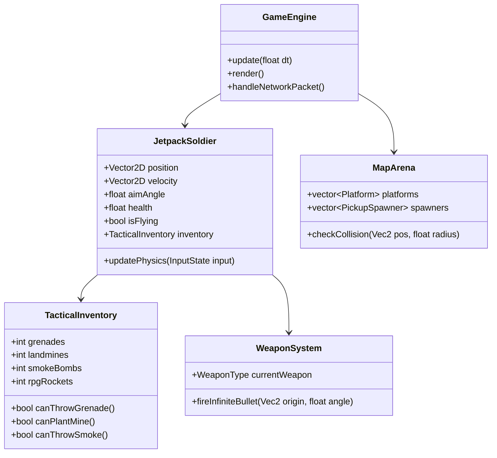

# 🏛️ WEGETHER — Architecture & Network Protocol Specification

## 1. Network Message Schemas

All messages are JSON-serialized over WebSockets or binary-encoded in native C++ mode:

```json
{
  "type": "MESSAGE_TYPE",
  "payload": { ... }
}
```

### 1.1 Lobby & Match Setup
| Message Type | Direction | Payload | Description |
| :--- | :--- | :--- | :--- |
| `CREATE_LOBBY` | Client $\rightarrow$ Server | `{ "nickname": "Viper", "mode": "2v2" }` | Request 5-digit private room. |
| `LOBBY_CREATED`| Server $\rightarrow$ Client | `{ "roomCode": "K9X2P", "isHost": true, "lobby": { ... } }` | Room created with 5-digit code. |
| `JOIN_LOBBY` | Client $\rightarrow$ Server | `{ "roomCode": "K9X2P", "nickname": "Ghost" }` | Join room via 5-digit code. |
| `SET_TEAM` | Client $\rightarrow$ Server | `{ "team": "RED" | "BLUE" }` | Switch team assignment. |
| `START_GAME` | Host $\rightarrow$ Server | `{}` | Host initiates match countdown. |
| `MATCH_START` | Server $\rightarrow$ All | `{ "roomCode": "K9X2P", "mode": "2v2", "map": "Outpost" }` | Transitions all clients to combat arena. |

### 1.2 Combat & Tactical Item Events
| Message Type | Direction | Payload | Description |
| :--- | :--- | :--- | :--- |
| `PLAYER_SYNC` | Client $\rightarrow$ Server | `{ "x": 250, "y": 380, "vx": 2.1, "vy": -4.2, "aim": 1.52, "isFlying": true, "hp": 100 }` | 30Hz continuous player state broadcast. |
| `BULLET_FIRE` | Client $\rightarrow$ Server | `{ "x": 260, "y": 380, "vx": 16.0, "vy": 2.4, "weapon": "UZI", "color": "#00E5FF" }` | Primary infinite bullet broadcast. |
| `GRENADE_THROW` | Client $\rightarrow$ Server | `{ "id": "g_1", "x": 250, "y": 380, "vx": 8.5, "vy": -10.2 }` | Frag grenade throw with arc trajectory. |
| `MINE_PLANT` | Client $\rightarrow$ Server | `{ "id": "m_1", "x": 300, "y": 520, "team": "RED" }` | Proximity mine planted on surface. |
| `SMOKE_SPAWN` | Client $\rightarrow$ Server | `{ "id": "s_1", "x": 450, "y": 480 }` | Smoke cloud deployment. |
| `PICKUP_COLLECT`| Client $\rightarrow$ Server | `{ "pickupId": "pk_grenade_1", "playerId": "P_1" }` | Pickup crate collected. |
| `PLAYER_HIT` | Client $\rightarrow$ Server | `{ "victimId": "P_2", "killerId": "P_1", "damage": 25 }` | Hit confirmation event. |
| `PLAYER_KILLED` | Client $\rightarrow$ Server | `{ "victimId": "P_2", "killerId": "P_1", "weapon": "GRENADE" }` | Kill feed & score attribution. |

---

## 2. C++ Native Module Architecture



### Zero-Allocation Ring Buffers
In C++, dynamic memory allocations during combat cause frame drops on mobile. All entities (bullets, grenades, particles, smoke nodes) are pre-allocated in static memory pools:

```cpp
template<typename T, size_t MAX_SIZE>
class StaticEntityPool {
    T entities[MAX_SIZE];
    size_t count = 0;
public:
    T* allocate() {
        if (count < MAX_SIZE) return &entities[count++];
        return nullptr;
    }
    void clear() { count = 0; }
    size_t size() const { return count; }
    T& operator[](size_t index) { return entities[index]; }
};
```
