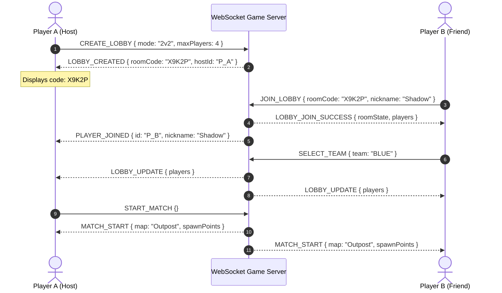
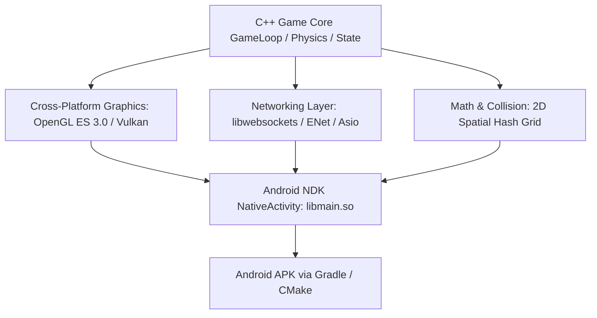

# 🎮 Mini Militia-Style Multiplayer 2D Shooter — Master Blueprint & Private Lobby System

A high-performance, cross-platform 2D multiplayer shooter inspired by **Doodle Army 2: Mini Militia**. Designed for high-octane 60/120 FPS mobile gameplay featuring **jetpack flight physics, dual-stick weapon aiming, real-time multiplayer, and a robust 5-digit private lobby system**.

---

## 📋 Table of Contents
1. [Core Features & Game Modes](#-core-features--game-modes)
2. [5-Digit Private Lobby System](#-5-digit-private-lobby-system)
3. [Best Free Hosting Providers for 24/7 Online Play](#-best-free-hosting-providers-for-247-online-play)
4. [C++ Native Android Compilation Architecture](#-c-native-android-compilation-architecture)
5. [Project Directory Layout](#-project-directory-layout)
6. [Quick Start & Testing](#-quick-start--testing)

---

## 🎯 1. Core Features & Game Modes

### Gameplay Mechanics (Mini Militia Formula)
* **Jetpack Flight**: Left joystick controls movement + jetpack thrust with finite gas meter (recharges when grounded).
* **Dual-Stick 360° Aiming**: Right joystick aims laser crosshair and auto-fires when pulled past deadzone.
* **Weapon Arsenal**:
  * **Pistol / Dual Uzis** (Fast firing, light recoil).
  * **Shotgun** (Spread burst, lethal at close quarters).
  * **Sniper Rifle** (Long-range laser with high single-shot damage).
  * **Rocket Launcher / Grenades** (Area-of-effect explosive radius).
  * **Melee Punch** (High-damage dash attack when out of ammo).
* **Respawn & Kill Feeds**: Real-time broadcast of kills, headshots, and revenge badges.

### Match Formats Supported
* **1v1 Duel**: Quick sudden-death match (First to 5 or 10 kills).
* **2v2 Team Deathmatch (TDM)**: Red Team vs. Blue Team with shared team score.
* **1v1v1v1 Free For All (FFA)**: 4 to 8 players in a chaotic deathmatch arena.
* **Custom Rules**: Adjustable time limit (3 to 10 mins), kill cap, and weapon loadouts.

---

## 🔑 2. 5-Digit Private Lobby System

### Room Code Generation & Lifecycle


### Unique 5-Digit Code Generator Algorithm
Codes exclude easily confused characters (like `0`, `O`, `1`, `I`):
```javascript
const CHARSET = "23456789ABCDEFGHJKLMNPQRSTUVWXYZ"; // 32 characters = 33.5M unique 5-character combos!
function generateRoomCode() {
  let code = "";
  for (let i = 0; i < 5; i++) {
    code += CHARSET.charAt(Math.floor(Math.random() * CHARSET.length));
  }
  return code;
}
```

---

## 🌐 3. Best Free Hosting Providers for 24/7 Online Play

Here is the curated list of the best **100% free server hosting options** to run your multiplayer game server online with friends worldwide:

| Provider | Free Tier Details | WebSockets / TCP Support | Setup Ease | Recommended For |
| :--- | :--- | :--- | :--- | :--- |
| **1. Render.com** *(Top Pick)* | 750 free instance hours/mo, free custom subdomains (`yourgame.onrender.com`), automatic SSL/WSS. | ✅ Full WebSocket (WSS) | ⭐⭐⭐⭐⭐ (Git push deploy) | Instant setup for private lobbies with 0 server maintenance. |
| **2. Oracle Cloud Free Tier** | **2x AMD VMs + 4-core 24GB RAM ARM VM (100% Always Free Forever!)** with 10 TB free monthly egress bandwidth. | ✅ Full TCP, UDP & WebSockets | ⭐⭐⭐⭐ (Linux VPS) | Ultimate choice for dedicated high-performance C++ UDP servers. |
| **3. Railway.app** | $5 free monthly credit (~500+ active execution hours), zero-config Docker builds. | ✅ Full WebSocket & TCP | ⭐⭐⭐⭐⭐ (1-click deploy) | Fast testing and low latency. |
| **4. Fly.io** | 3 shared-cpu-1x VMs free, globally distributed edge locations (lowest ping). | ✅ UDP & WebSockets | ⭐⭐⭐⭐ (CLI deploy) | Low-ping mobile real-time physics. |
| **5. Playit.gg / Ngrok** | 100% free tunneling tool that lets you host directly from your home PC without port forwarding. | ✅ UDP, TCP, WebSockets | ⭐⭐⭐⭐⭐ (Install & run) | Instant local testing with friends anywhere in the world. |

> [!TIP]
> **Recommended Strategy**: Use **Render.com** (with the included `render.yaml` / Docker configuration) for quick zero-cost 24/7 lobby hosting, or use **Playit.gg** when you want to host live from your PC.

---

## ⚡ 4. C++ Native Android Compilation Architecture

To achieve the best mobile performance, battery efficiency, and 120Hz refresh rates:



### Why Native C++ (`libmain.so`) over pure Java/Kotlin?
1. **Zero Garbage Collection Stutters**: Java GC pauses cause micro-stutters during combat. C++ uses contiguous memory pools and arenas.
2. **Deterministic Physics**: Physics step rates run at a fixed 60Hz tick independent of device frame rate.
3. **Multi-Platform Code Sharing**: The exact same C++ codebase compiles for Android (`arm64-v8a`), Windows (`.exe`), Linux, and WebAssembly (`.wasm`).

---

## 📁 5. Project Directory Layout

```
multiplayer-game/
├── README.md                      # This master blueprint & hosting guide
├── ARCHITECTURE.md                # Network packet layout & C++ engine specs
├── server/                        # Node.js / WebSocket Lobby & Game Relay Server
│   ├── package.json
│   ├── server.js                  # 5-Digit Private Room Manager & Match Handler
│   ├── Dockerfile                 # Cloud container deployment definition
│   └── render.yaml                # 1-Click Deploy config for Render.com
├── client-web/                    # Visual Interactive Test Client (Test lobbies instantly!)
│   ├── index.html                 # Private Lobby UI + 2D Jetpack Shooter Arena
│   ├── style.css                  # Military neon HUD & lobby styling
│   └── game.js                    # Dual-stick controls & multiplayer socket sync
└── cpp-native/                    # Native C++ Android Project
    ├── CMakeLists.txt             # NDK CMake build configuration
    ├── src/
    │   ├── main.cpp               # Android NativeActivity entry point
    │   ├── NetworkClient.hpp      # C++ WebSocket / TCP socket abstraction
    │   ├── Player.hpp             # Jetpack physics & duel-stick shooter logic
    │   └── LobbyManager.hpp       # C++ Private 5-digit code lobby state
    └── android-project/           # Gradle build harness to generate .apk
```

---

## 🚀 6. Quick Start & Testing

### Running the Server Locally
```powershell
cd C:\Users\beepl\dev\multiplayer-game\server
npm install
npm start
```
The server will start at `http://localhost:3000` (WebSocket at `ws://localhost:3000`).

### Testing Private 5-Digit Lobbies
1. Start the server.
2. Open `client-web/index.html` in two separate browser windows (or on your phone).
3. Player 1: Click **"Create Private Lobby"** $\rightarrow$ receives code (e.g. `H7M2Q`).
4. Player 2: Enters `H7M2Q` $\rightarrow$ joins Player 1's room in real-time!
5. Select teams (Red/Blue or FFA) and click **"Start Match"** to fly and battle!
# multiplayer-game
